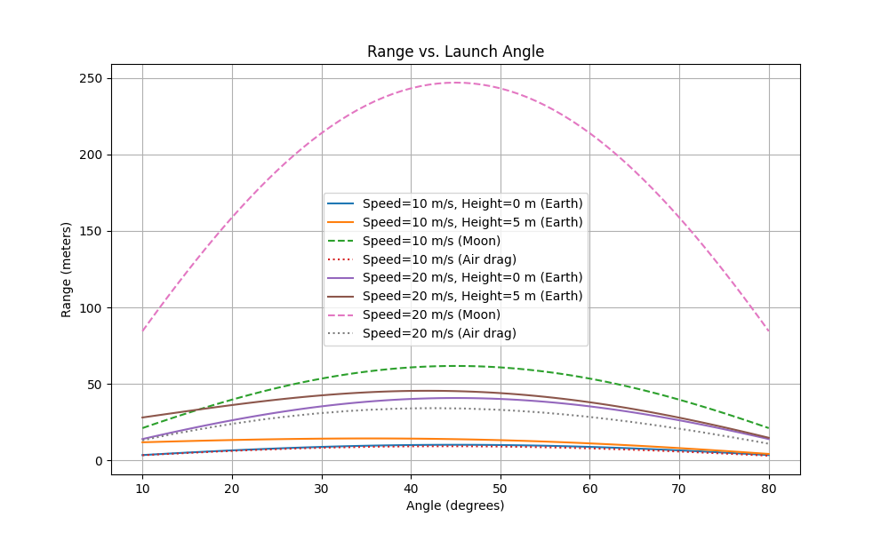

# Problem 1

# Theoretical Foundation

Projectile motion starts with two simple ideas: horizontally, a projectile moves at a steady speed because nothing pushes it side-to-side; vertically, gravity pulls it down at a constant rate (9.81 m/s² on Earth). These rules create a curved path, like throwing a ball. The path changes based on:

***Speed:*** 
Throw faster, it goes farther and higher.

***Angle:***
 Low angles favor distance; high angles give height.

***Starting height:*** 
Throwing from higher up extends the flight.

***Gravity:*** 
Weaker gravity (like the Moon’s) stretches the path
.
This creates a “family” of paths—each mix of speed, angle, height, or gravity gives a unique curve. For example, a hard throw at 45°
 travels far, while a soft throw straight up lands close. These variations fit many scenarios, from sports to space launches.

# Analysis of the Range

The range (how far the projectile lands) depends heavily on the launch angle:

***Best angle:*** Around 45° usually gives the farthest range on flat ground, balancing height and distance.

***Symmetry:*** Angles like 30° and 60° give the same range, but less than 45°.

***No range:*** Throwing straight up (90°) or flat (0°) means it doesn’t go anywhere horizontally.

### Other factors affect the range too:

***Speed:*** A faster throw (e.g., 20 m/s vs. 10 m/s) sends it much farther.

***Gravity:*** On the Moon (gravity = 1.62 m/s²), the range is way longer than on Earth.

***Starting height:*** Throwing from a height (e.g., 5 m up) adds distance because it stays in the air longer.

For example, a 20 m/s throw at 45° goes farther than a 10 m/s throw, and even farther if launched from a hill or on the Moon.

# Practical Applications

This model applies to real-world situations but needs tweaks for accuracy:

***Uneven terrain:***
 On a hill, the landing spot shifts. A downhill slope might increase range, like a golf ball rolling farther.

***Air resistance:*** 
Air slows the projectile, shortening the range. The best angle drops to maybe 35°–40°, as seen in sports like baseball.

### Examples:

***Sports:*** 
In soccer, a well-angled kick clears defenders and reaches the goal. Golfers aim for distance with similar angle choices.

***Engineering:*** Cannons use these ideas but adjust for wind or hills to hit targets.

***Space:*** On Mars or the Moon, lower gravity means rovers or probes travel farther, helping plan landings.

To make it realistic, we can add air resistance or terrain shapes, often using numerical simulations to handle complex effects, as shown in the script below.

# Implementation

### What the plot shows:

***Angles:***
 Range peaks near 45° for flat ground, slightly lower with height or airresistance.

***Speed:***
 20 m/s throws go farther than 10 m/s.

***Height:*** 
Starting 5 m up increases range.

***Moon:*** 
Lower gravity boosts range a lot.

***Air resistance:***
 Shortens range and shifts the best angle to ~35°–40°.

***This matches our analysis:***
45° is best without complications, but speed, height, gravity, or air change the outcome.

