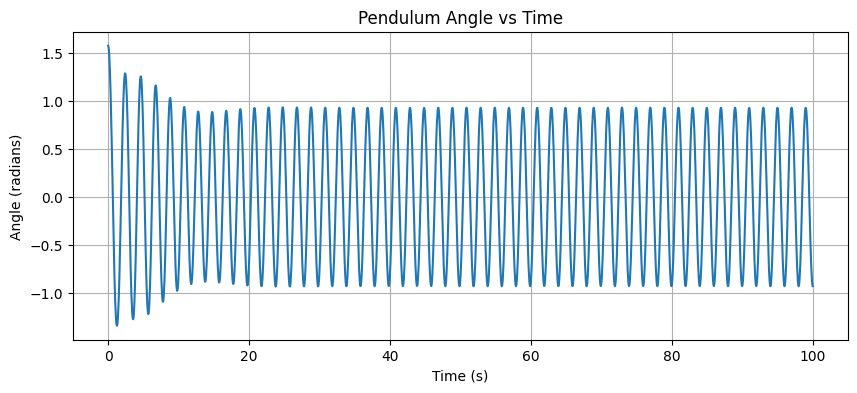
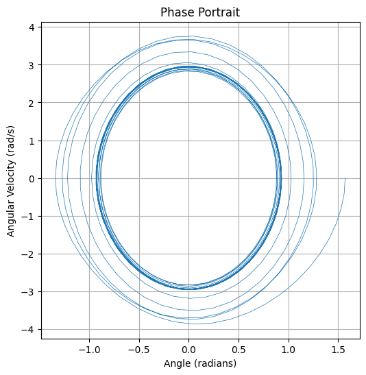

# Problem 2

# Theoretical Foundation:

The motion of a forced damped pendulum is governed by the equation $\frac{d^2\theta}{dt^2} + b \frac{d\theta}{dt} + \frac{g}{L} \sin \theta = A \cos(\omega t)$.

 This equation accounts for the pendulum's natural tendency to swing back due to gravity (related to $g/L$), the slowing effect of damping or friction (the $b$ term), and an external force pushing it back and forth with strength $A$ and frequency $\omega$.

For small swings (small angles $\theta$), the behavior simplifies because $\sin \theta$ is approximately equal to $\theta$.

 In this case, the pendulum acts much like simpler systems such as a mass on a spring with friction that's being pushed. 

 It will eventually synchronize its swing to the frequency $\omega$ of the external force.

A key behavior is **resonance**.

 Similar to how pushing a swing at its natural rhythm makes it go much higher, if the frequency $\omega$ of the external force closely matches the pendulum's natural frequency (related to $g/L$ for small angles), the pendulum's swings become very large.

  This is when the system absorbs the most energy from the driving force. Understanding these basics helps explore how the interplay of damping, forcing, and the pendulum's properties leads to its diverse dynamics.


# Analysis of Dynamics:

**1. How Parameters Influence Motion:**

* **Damping Coefficient ($\beta$):**

    * Higher damping tends to make the motion simpler (like settling into a regular swing following the driver) and prevents chaos.

    * Lower damping allows for more complex behavior, including larger swings (resonance) and the possibility of chaos.

* **Driving Amplitude ($A$):**

    * Small amplitude usually results in simple, predictable, periodic motion.

    * Increasing the amplitude provides more energy, which can lead to more complex periodic motions (e.g., swinging differently on successive cycles) and eventually trigger chaotic motion.

* **Driving Frequency ($\omega_D$):**

    * Affects resonance: If the driving frequency is near the pendulum's natural frequency ($\omega_0$), swings can become very large (especially with low damping).

    * Different frequencies can lead to different types of motion – the pendulum might sync up with the driver, follow a more complex repeating pattern, or become chaotic.

**2. Transition Between Regular and Chaotic Motion:**

* **Regular Motion:**

 The pendulum's movement is predictable and repeats over time (e.g., swinging back and forth in the exact same way every cycle or every few cycles).

* **Chaotic Motion:**

 The movement is unpredictable, erratic, and never exactly repeats. Tiny changes in the starting condition lead to vastly different swings later on.

* **The Transition:**

 As a parameter like the driving amplitude ($A$) is gradually increased, the pendulum's motion can shift from regular to chaotic.

 This often happens in stages, where the motion pattern becomes progressively more complex (e.g., taking twice as long to repeat, then four times, etc. – "period-doubling") before becoming fully chaotic.

**Physical Interpretations:**

* **Regular:**

 Represents stable, predictable states where the energy input, damping, and pendulum's natural swing find a repeating balance.

* **Chaotic:**

 Represents a highly sensitive, unstable state where the system never settles into a repeating pattern due to the complex interplay between the driving force, damping, and the pendulum's non-linear response.


# Implementation

```python
import numpy as np
from scipy.integrate import solve_ivp
import matplotlib.pyplot as plt

def pendulum_ode(t, y, beta, omega0_sq, A, omega_D):
    """
    System of ODEs for the forced damped pendulum.
    y[0] = theta (angle)
    y[1] = omega (angular velocity)
    """
    theta, omega = y
    dtheta_dt = omega
    domega_dt = -2 * beta * omega - omega0_sq * np.sin(theta) + A * np.cos(omega_D * t)
    return [dtheta_dt, domega_dt]

g = 9.81
L = 1.0
omega0 = np.sqrt(g / L)
omega0_sq = g / L

beta = 0.2
A = 1.5
omega_D = 1.0 * omega0 

y0 = [np.pi / 2, 0.0]

t_start = 0
t_end = 100            
num_points = 2000      
t_span = [t_start, t_end]
t_eval = np.linspace(t_start, t_end, num_points) 


sol = solve_ivp(
    pendulum_ode,
    t_span,
    y0,
    args=(beta, omega0_sq, A, omega_D),
    dense_output=True, 
    t_eval=t_eval  
)

if not sol.success:
    print(f"ODE solver failed: {sol.message}")
else:
    print("ODE solver successful.")

    theta_t = sol.y[0]
    omega_t = sol.y[1]
    times = sol.t

    theta_t_adjusted = np.arctan2(np.sin(theta_t), np.cos(theta_t))

    plt.figure(figsize=(10, 4))
    plt.plot(times, theta_t_adjusted)
    plt.title('Pendulum Angle vs Time')
    plt.xlabel('Time (s)')
    plt.ylabel('Angle (radians)')
    plt.grid(True)
    plt.show()

    plt.figure(figsize=(6, 6))
    plt.plot(theta_t_adjusted, omega_t, lw=0.5) 
    plt.title('Phase Portrait')
    plt.xlabel('Angle (radians)')
    plt.ylabel('Angular Velocity (rad/s)')
    plt.grid(True)
    plt.show()

```

 

 

