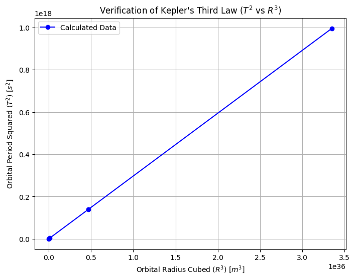
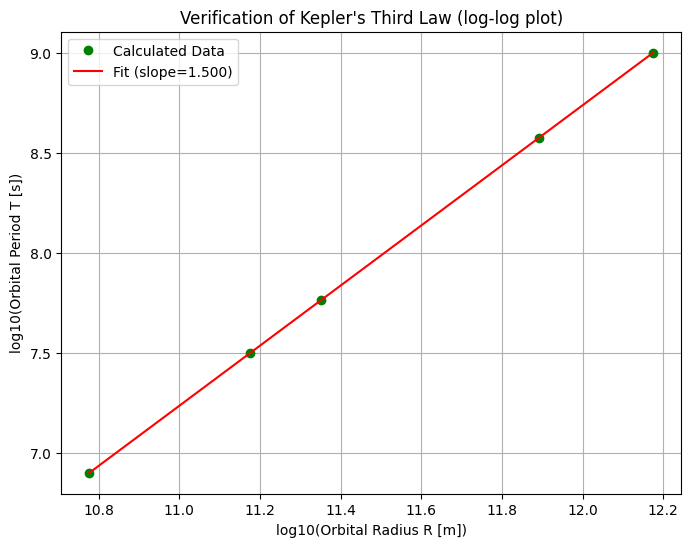
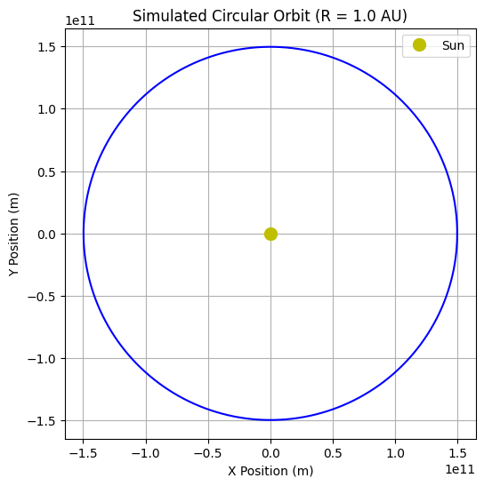

# Problem 1

# 1

1.  **Balance in Orbit:**

 For a planet to orbit the Sun (or a moon to orbit a planet), there's a balance. The pull of gravity trying to draw it inwards is matched by the planet's tendency to keep moving forward and outward.

2.  **Effect of Distance on Gravity:**

 Gravity gets weaker the farther away you are. A planet far from the Sun feels a weaker pull than a planet close to the Sun.

3.  **Effect of Distance on Speed:**

 Because gravity is weaker farther out, a distant planet doesn't need to move as fast to stay in its balanced orbit.

Closer planets feel a stronger pull and need to zip around much faster to avoid falling in. So,

**planets farther away move slower.**

4.  **Effect of Distance on Path:** 

A planet farther from the Sun also has a much bigger circle (orbit) to travel around.

 **Its path is longer.**

5.  **Combining Effects on Time (Period):**

 Now, consider the time it takes to complete one orbit (the period):
    * The planet is moving **slower**.
    * It has a **longer path** to travel.
    * Both these things mean it takes *significantly more time* for a distant planet to complete one orbit compared to a closer one.

6.  **The Specific Rule Found:**
 When astronomers carefully observed and measured this, they found a very specific pattern connecting the orbital time (Period, T) and the distance (Radius, R): The square of the time ($T^2$) increases exactly in step with the cube of the distance ($R^3$).

So, the logical steps are: farther distance -> weaker gravity -> slower speed -> longer path -> *much* longer orbital time, following the specific relationship $T^2 \propto R^3$.

# 2
***key implications of the $T^2 \propto R^3$ relationship:***

1.  **Mapping the Solar System:** 

It allows astronomers to figure out the distances of planets from the Sun by measuring how long their orbits take (their periods).
 If you know one distance accurately, you can find all the others.

2.  **Weighing Celestial Objects:**

 This is a major use! By observing something in orbit (like a moon around a planet, or a planet around a star) and measuring its period ($T$) and orbital size ($R$), astronomers can calculate the **mass** of the central object it's orbiting. This is how we know the mass of the Sun, planets with moons, and even distant stars.

3.  **Understanding Speed and Time:** 

It explains why planets farther out move slower and take much, much longer to complete one orbit.

4.  **Studying Exoplanets:**

Helps determine how far planets are from their stars, which is key to understanding if they might be habitable.


# 4 Implementation

```python
import numpy as np
import matplotlib.pyplot as plt

G = 6.67430e-11
M_sun = 1.989e30

AU = 1.496e11
radii = np.array([0.4, 1.0, 1.5, 5.2, 10.0]) * AU

periods_squared = []
radii_cubed = []
periods = []
kepler_ratios = []

GM = G * M_sun

for R in radii:
    T_squared = (4 * np.pi**2 * R**3) / GM
    T = np.sqrt(T_squared)
    periods.append(T)
    periods_squared.append(T_squared)
    radii_cubed.append(R**3)
    ratio = T_squared / (R**3)
    kepler_ratios.append(ratio)

expected_ratio = (4 * np.pi**2) / GM

plt.figure(figsize=(8, 6))
plt.plot(radii_cubed, periods_squared, 'bo-', label='Calculated Data')
plt.title("Verification of Kepler's Third Law ($T^2$ vs $R^3$)")
plt.xlabel("Orbital Radius Cubed ($R^3$) [$m^3$]")
plt.ylabel("Orbital Period Squared ($T^2$) [$s^2$]")
plt.grid(True)
plt.ticklabel_format(style='sci', axis='both', scilimits=(0,0))
plt.legend()
plt.show()

plt.figure(figsize=(8, 6))
log_T = np.log10(np.array(periods))
log_R = np.log10(radii)
slope, intercept = np.polyfit(log_R, log_T, 1)
plt.plot(log_R, log_T, 'go', label='Calculated Data')
plt.plot(log_R, slope * log_R + intercept, 'r-', label=f'Fit (slope={slope:.3f})')
plt.title("Verification of Kepler's Third Law (log-log plot)")
plt.xlabel("log10(Orbital Radius R [m])")
plt.ylabel("log10(Orbital Period T [s])")
plt.grid(True)
plt.legend()
plt.show()

R_orbit = AU
T_orbit = np.sqrt((4 * np.pi**2 * R_orbit**3) / GM)
omega = 2 * np.pi / T_orbit
t_orbit_points = np.linspace(0, T_orbit, 200)
x_orbit = R_orbit * np.cos(omega * t_orbit_points)
y_orbit = R_orbit * np.sin(omega * t_orbit_points)

plt.figure(figsize=(6, 6))
plt.plot(x_orbit, y_orbit, 'b-')
plt.plot(0, 0, 'yo', markersize=10, label='Sun')
plt.title(f'Simulated Circular Orbit (R = {R_orbit/AU:.1f} AU)')
plt.xlabel("X Position (m)")
plt.ylabel("Y Position (m)")
plt.gca().set_aspect('equal', adjustable='box')
plt.grid(True)
plt.legend()
plt.ticklabel_format(style='sci', axis='both', scilimits=(0,0))
plt.show()
```








