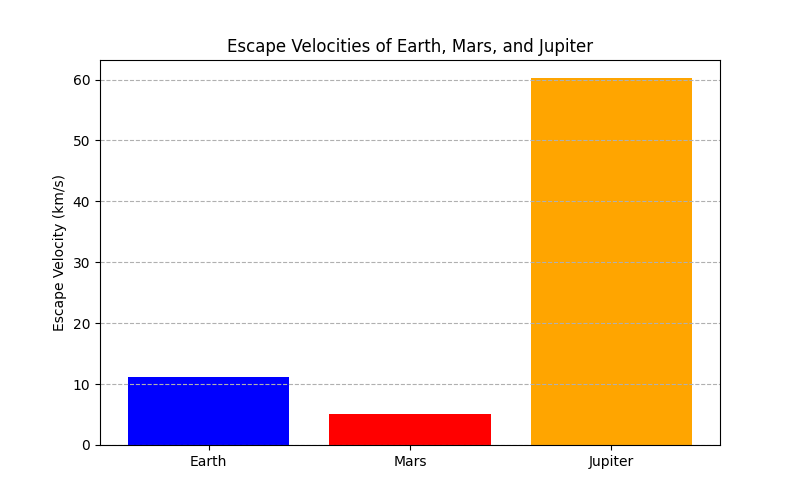
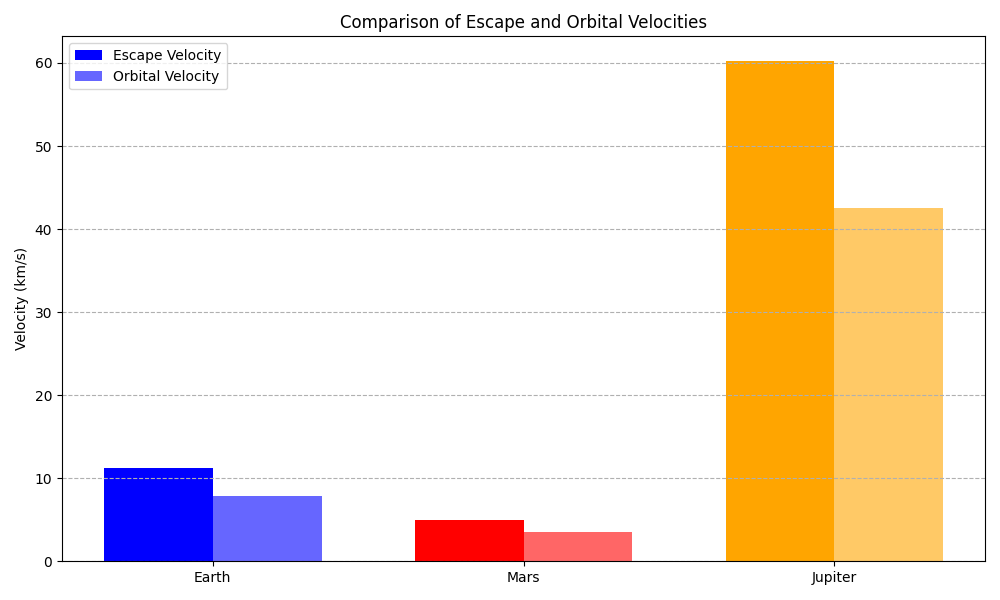

# Problem 2

# Define velocities:

***First Cosmic Velocity (Orbital Velocity):***

The speed to orbit a celestial body without falling back. Gravity pulls it down, but its speed keeps it moving forward, resulting in a continuous circle.

***Second Cosmic Velocity (Escape Velocity):***

The speed to break free from a celestial body's gravity completely and never return. It's the point where the object has enough energy to overcome the gravitational pull.

***Third Cosmic Velocity (Solar System Escape Velocity):***
The speed needed, when launching from Earth, to escape the Sun's gravity and leave the entire solar system. It's about overcoming the Sun's pull while already moving with Earth.

# Analyzing mathematical derivations of velocities:


### First Cosmic Velocity (Orbital Velocity)

* **Simplified Derivation:**

 For a stable circular orbit, the gravitational force pulling the object towards the center of the celestial body must equal the centripetal force needed to keep it moving in a circle.
    $$\frac{GMm}{r^2} = \frac{mv_1^2}{r}$$
    Where:
    * \(G\) is the universal gravitational constant.
    * \(M\) is the mass of the celestial body.
    * \(m\) is the mass of the orbiting object (which cancels out).
    * \(r\) is the radius of the orbit (approximately the radius of the celestial body if orbiting just above the surface).
    * \(v_1\) is the first cosmic velocity.

    Solving for \(v_1\), we get:
    $$v_1 = \sqrt{\frac{GM}{r}}$$

* **Parameters Affecting \(v_1\):**
    * **Mass of the Celestial Body (\(M\)):** A more massive body exerts a stronger gravitational pull, requiring a higher orbital velocity to maintain a stable orbit. \(v_1\) is directly proportional to the square root of \(M\).
    * **Radius of the Orbit (\(r\)):** The closer the orbit is to the center of the celestial body (smaller \(r\)), the stronger the gravitational force and the higher the required orbital velocity. \(v_1\) is inversely proportional to the square root of \(r\).

### Second Cosmic Velocity (Escape Velocity)

* **Simplified Derivation:** Escape velocity is achieved when the kinetic energy of an object is equal to the magnitude of its gravitational potential energy.
    $$\frac{1}{2}mv_e^2 = \frac{GMm}{r}$$
    Where:
    * \(G\) is the universal gravitational constant.
    * \(M\) is the mass of the celestial body.
    * \(m\) is the mass of the escaping object (which cancels out).
    * \(r\) is the initial distance from the center of the celestial body (typically its radius).
    * \(v_e\) is the escape velocity.

Solving for \(v_e\), we get:
    $$v_e = \sqrt{\frac{2GM}{r}}$$

 Notice that \(v_e = \sqrt{2} \cdot v_1\).

* **Parameters Affecting \(v_e\):**

 * **Mass of the Celestial Body (\(M\)):**

Similar to orbital velocity, a more massive body has a stronger gravitational pull, requiring a higher escape velocity. \(v_e\) is directly proportional to the square root of \(M\).

 * **Initial Distance from the Center (\(r\)):**

 The closer the object starts to the center (smaller \(r\)), the stronger the gravitational pull it needs to overcome, resulting in a higher escape velocity. \(v_e\) is inversely proportional to the square root of \(r\).

### Third Cosmic Velocity (Solar System Escape Velocity from Earth's Orbit)

* **Simplified Explanation of Parameters:**

 The third cosmic velocity is more complex as it involves escaping the gravitational influence of both Earth and the Sun.
 It depends on:
    * **Sun's Mass:**

 The primary factor determining the overall escape speed from the solar system at Earth's orbital distance.
 * **Earth's Orbital Velocity:**

Earth is already moving around the Sun at a significant speed. Launching in the direction of Earth's motion allows us to use this existing velocity as part of the escape velocity.

* **Earth's Mass and Radius:**

 These determine the escape velocity from Earth's surface, which is the initial "push" needed to get away from our planet's gravity before focusing on escaping the Sun.

* **Launch Trajectory:**

The direction of the initial velocity relative to Earth's orbital motion around the Sun significantly affects the required speed. Launching in Earth's direction of travel is most efficient.

* **Approximate Calculation (Conceptual):**
    1.  Calculate the escape velocity from the Sun's gravity at Earth's orbital distance.
    2.  Consider Earth's orbital velocity around the Sun.
    3.  The third cosmic velocity is roughly the speed needed (relative to Earth) so that the vector sum of this speed and Earth's orbital velocity equals the escape velocity from the Sun.

 We also need to account for escaping Earth's gravity initially.

The precise mathematical derivation involves energy conservation in both gravitational fields and is more involved than the first two cosmic velocities. The commonly cited value of approximately 16.7 km/s relative to Earth is the result of these more complex calculations and takes into account an optimal launch trajectory.

```python
import numpy as np
import matplotlib.pyplot as plt

G = 6.67430e-11

celestial_bodies_data = [
    {"name": "Earth", "mass": 5.972e24, "radius": 6.371e6, "color": "blue"},
    {"name": "Mars", "mass": 6.39e23, "radius": 3.390e6, "color": "red"},
    {"name": "Jupiter", "mass": 1.898e27, "radius": 6.9911e7, "color": "orange"},
]

def calculate_escape_velocity(mass, radius):
    return np.sqrt((2 * G * mass) / radius) / 1000

def calculate_orbital_velocity(mass, radius):
    return np.sqrt((G * mass) / radius) / 1000

for body in celestial_bodies_data:
    body["escape_velocity"] = calculate_escape_velocity(body["mass"], body["radius"])
    body["orbital_velocity"] = calculate_orbital_velocity(body["mass"], body["radius"])

print("Calculated Escape and Orbital Velocities (km/s):")
for body in celestial_bodies_data:
    print(f"{body['name']}:")
    print(f"  Escape Velocity: {body['escape_velocity']:.2f} km/s")
    print(f"  Orbital Velocity: {body['orbital_velocity']:.2f} km/s")
    print("-" * 20)

body_names = [body["name"] for body in celestial_bodies_data]
escape_velocities = [body["escape_velocity"] for body in celestial_bodies_data]
orbital_velocities = [body["orbital_velocity"] for body in celestial_bodies_data]
colors = [body["color"] for body in celestial_bodies_data]

plt.figure(figsize=(8, 5))
plt.bar(body_names, escape_velocities, color=colors)
plt.ylabel("Escape Velocity (km/s)")
plt.title("Escape Velocities of Earth, Mars, and Jupiter")
plt.grid(axis='y', linestyle='--')
plt.show()

plt.figure(figsize=(8, 5))
plt.bar(body_names, orbital_velocities, color=colors)
plt.ylabel("Orbital Velocity (km/s)")
plt.title("Orbital Velocities (at Surface) of Earth, Mars, and Jupiter")
plt.grid(axis='y', linestyle='--')
plt.show()

x = np.arange(len(body_names))
width = 0.35

fig, ax = plt.subplots(figsize=(10, 6))
rects1 = ax.bar(x - width/2, escape_velocities, width, label='Escape Velocity', color=colors)
rects2 = ax.bar(x + width/2, orbital_velocities, width, label='Orbital Velocity', color=colors, alpha=0.6)

ax.set_ylabel('Velocity (km/s)')
ax.set_title('Comparison of Escape and Orbital Velocities')
ax.set_xticks(x)
ax.set_xticklabels(body_names)
ax.legend()
ax.grid(axis='y', linestyle='--')

fig.tight_layout()
plt.show()

print("\nNote: The third cosmic velocity is specific to escaping the solar system from Earth and is not directly calculated or visualized here for individual planets.")
```




 


