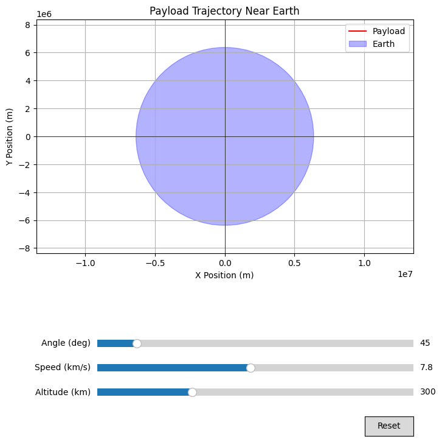

# Problem 3


Imagine throwing a ball upwards. What happens depends on how fast you throw it:

* **Too slow:**
It goes up and comes right back down in an **elliptical** path (a curve like a stretched circle). This is like a satellite in orbit – it's constantly falling but also moving forward, so it keeps going around.

* **Just right (escape velocity):**
If you throw it with exactly the right speed, it will go up, and its speed will slowly decrease until it almost stops infinitely far away.
This path is a **parabola** (a U-shaped curve that never closes).
It's the edge case where the object barely escapes Earth's pull.

* **Too fast:**
If you throw it even faster than the "just right" speed, it will fly away from Earth and still have some speed left even when it's very far away.
This path is a **hyperbola** (a wider U-shaped curve).

**What determines the path?**

The main thing is the **speed** of the payload when it's released.

* **Slow speed:** Leads to an elliptical orbit (it stays around Earth).
* **Medium speed (escape velocity):** Leads to a parabolic path (it barely escapes).
* **High speed:** Leads to a hyperbolic path (it definitely escapes).

The **direction** of the release also matters for the *shape* of the ellipse or hyperbola, but the *type* of path (elliptical, parabolic, or hyperbolic) is mainly decided by the speed compared to the **escape velocity** at that location.
Escape velocity is like the "break free" speed from Earth's gravity at a certain distance.

So, the possible paths are:

* **Elliptical:** For payloads that don't have enough speed to escape Earth.
* **Parabolic:** For payloads released at the exact speed needed to just barely escape Earth's gravity.
* **Hyperbolic:** For payloads released with more than enough speed to escape Earth's gravity.

# Perform a numerical analysis to compute the path of a payload released near Earth

```python
import numpy as np
import matplotlib.pyplot as plt

G = 6.67430e-11
M_earth = 5.972e24
R_earth = 6.371e6

initial_altitude = 300e3
initial_position = np.array([R_earth + initial_altitude, 0.0])
initial_velocity = np.array([0.0, 7800.0])

time_step = 10.0
total_time = 5000.0
num_steps = int(total_time / time_step)

trajectory = np.zeros((num_steps + 1, 2))
velocity_history = np.zeros((num_steps + 1, 2))
time_points = np.linspace(0, total_time, num_steps + 1)

trajectory[0] = initial_position
velocity_history[0] = initial_velocity

def calculate_acceleration(position):
    r = np.linalg.norm(position)
    if r == 0:
        return np.array([0.0, 0.0])
    acceleration = -G * M_earth / (r**3) * position
    return acceleration

for i in range(num_steps):
    current_position = trajectory[i]
    current_velocity = velocity_history[i]
    acceleration = calculate_acceleration(current_position)

    next_velocity = current_velocity + acceleration * time_step
    velocity_history[i + 1] = next_velocity

    next_position = current_position + next_velocity * time_step
    trajectory[i + 1] = next_position

plt.figure(figsize=(8, 8))
plt.plot(trajectory[:, 0], trajectory[:, 1], label='Payload Trajectory')

earth_circle = plt.Circle((0, 0), R_earth, color='blue', alpha=0.3, label='Earth')
plt.gca().add_patch(earth_circle)

plt.xlabel('X Position (m)')
plt.ylabel('Y Position (m)')
plt.title('Payload Trajectory Near Earth')
plt.axhline(0, color='black', linewidth=0.5)
plt.axvline(0, color='black', linewidth=0.5)
plt.grid(True)
plt.legend()
plt.axis('equal')
plt.show()
```


**Explanation:**

1.  **Constants and Initial Conditions:**

We define Earth's gravitational constant, mass, and radius. We then set initial values for the payload's altitude, position (in a 2D plane for simplicity), and velocity. You can change these initial conditions to explore different trajectories.

2.  **Simulation Parameters:**

We set the time step for the numerical integration and the total simulation time. The number of steps is calculated accordingly.

3.  **Data Storage:**

We create NumPy arrays to store the payload's position (trajectory) and velocity at each time step.

4.  **`calculate_acceleration(position)` Function:**
This function takes the current position of the payload and calculates the gravitational acceleration vector acting on it due to Earth.

5.  **Numerical Integration Loop:**
    * In each step, we get the current position and velocity.
    * We calculate the acceleration at the current position.
    * We update the velocity using the Euler method: $\mathbf{v}_{i+1} = \mathbf{v}_i + \mathbf{a}_i \Delta t$.
    * We update the position using the Euler method: $\mathbf{r}_{i+1} = \mathbf{r}_i + \mathbf{v}_{i+1} \Delta t$.
    * The new velocity and position are stored in the respective arrays.
6.  **Visualization:**
    * We plot the y-position against the x-position to visualize the trajectory.
    * We add a circle representing Earth for reference.
    * We label the axes, add a title, and include a grid.
    * `plt.axis('equal')` ensures that the scaling of the x and y axes is the same, so Earth appears circular.
    * `plt.show()` displays the plot.

**Limitations of the Euler Method:**

The Euler method is a simple first-order numerical method. It can introduce significant errors, especially for longer simulations or larger time steps. For more accurate results, more sophisticated numerical methods like the Runge-Kutta methods (e.g., RK4) would be preferred. However, for a basic visualization of the trajectory types, the Euler method can be sufficient.


# Discussing how these trajectories relate to orbital insertion, reentry, or escape scenarios.

**1. Orbital Insertion:**

* To insert a spacecraft or payload into a stable orbit, the goal is to achieve an **elliptical trajectory** with a periapsis (closest point to Earth) above the atmosphere.
* Launch vehicles typically propel the payload to a certain altitude and velocity. The final stage of the launch involves precisely firing engines to adjust the trajectory into the desired elliptical orbit.
* If the velocity at the insertion point is too low, the ellipse's periapsis might intersect the atmosphere, leading to reentry. If the velocity is too high (but below escape velocity), a highly elliptical orbit is achieved, which might require further maneuvers to circularize.

**2. Reentry:**

* Reentry involves transitioning from an orbit (elliptical trajectory) to a path that intersects the Earth's atmosphere.
* This is achieved by reducing the spacecraft's velocity, typically through a retrograde burn (firing engines opposite to the direction of motion).
* The resulting trajectory is still initially elliptical but with a periapsis that dips into the atmosphere. Atmospheric drag then plays a significant role in slowing down and heating the spacecraft.
* The angle of the reentry trajectory is critical. Too shallow an angle can cause the spacecraft to skip off the atmosphere, while too steep an angle can lead to excessive heating and deceleration.

**3. Escape Scenarios:**

* To escape Earth's gravitational influence, a spacecraft must achieve at least the **parabolic trajectory** (escape velocity).
* For interplanetary missions, spacecraft are often launched into a highly elliptical transfer orbit. A final, powerful burn is executed at the perigee of this orbit to increase the velocity to or above escape velocity, resulting in a **hyperbolic trajectory** relative to Earth.
* The excess velocity above escape velocity determines the speed at which the spacecraft will leave Earth's sphere of influence and begin its heliocentric (Sun-centered) trajectory.

**In essence:**

* **Elliptical trajectories** are the foundation of orbital mechanics, used for staying in orbit and for transferring between different orbits (e.g., Hohmann transfer orbits, which are elliptical).
* **Parabolic trajectories** represent the minimum energy path to escape a celestial body's gravity.
* **Hyperbolic trajectories** are used when a spacecraft needs to leave a planet's vicinity with a certain excess velocity for interplanetary travel.

Understanding these fundamental trajectory types and the velocities associated with them is crucial for planning and executing any space mission, whether it's placing a satellite in orbit, returning astronauts to Earth, or sending probes to explore the solar system.


# Computational tool to simulate and visualize the motion of the payload under Earth's gravity

```python
import numpy as np
import matplotlib.pyplot as plt
from matplotlib.widgets import Slider, Button

G = 6.67430e-11
M_earth = 5.972e24
R_earth = 6.371e6

initial_altitude = 300e3
initial_speed = 7800.0
initial_angle_deg = 45.0

time_step = 10.0
total_time = 5000.0
num_steps = int(total_time / time_step)

fig, ax = plt.subplots(figsize=(8, 8))
plt.subplots_adjust(bottom=0.4)

def initialize_payload(altitude, speed, angle_deg):
    radius = R_earth + altitude
    angle_rad = np.deg2rad(angle_deg)
    initial_position = np.array([radius, 0.0])
    initial_velocity = np.array([speed * np.cos(angle_rad), speed * np.sin(angle_rad)])
    return initial_position, initial_velocity

initial_position, initial_velocity = initialize_payload(initial_altitude, initial_speed, initial_angle_deg)

trajectory, = ax.plot([], [], 'r-', label='Payload')
earth_circle = plt.Circle((0, 0), R_earth, color='blue', alpha=0.3, label='Earth')
ax.add_patch(earth_circle)
ax.set_xlabel('X Position (m)')
ax.set_ylabel('Y Position (m)')
ax.set_title('Payload Trajectory Near Earth')
ax.axhline(0, color='black', linewidth=0.5)
ax.axvline(0, color='black', linewidth=0.5)
ax.grid(True)
ax.axis('equal')
ax.set_xlim(-(R_earth + 2e6), (R_earth + 2e6))
ax.set_ylim(-(R_earth + 2e6), (R_earth + 2e6))
ax.legend()

def calculate_acceleration(position):
    r = np.linalg.norm(position)
    if r == 0:
        return np.array([0.0, 0.0])
    acceleration = -G * M_earth / (r**3) * position
    return acceleration

def simulate_trajectory(initial_pos, initial_vel, time_s, dt):
    num = int(time_s / dt)
    traj = np.zeros((num + 1, 2))
    vel_history = np.zeros((num + 1, 2))
    traj[0] = initial_pos
    vel_history[0] = initial_vel
    for i in range(num):
        current_pos = traj[i]
        current_vel = vel_history[i]
        accel = calculate_acceleration(current_pos)
        next_vel = current_vel + accel * dt
        vel_history[i + 1] = next_vel
        next_pos = current_pos + next_vel * dt
        traj[i + 1] = next_pos
    return traj

ax_altitude = plt.axes([0.25, 0.1, 0.65, 0.03])
slider_altitude = Slider(
    ax=ax_altitude,
    label='Altitude (km)',
    valmin=0,
    valmax=1000,
    valinit=initial_altitude / 1e3,
    valstep=10
)

ax_speed = plt.axes([0.25, 0.15, 0.65, 0.03])
slider_speed = Slider(
    ax=ax_speed,
    label='Speed (km/s)',
    valmin=1,
    valmax=15,
    valinit=initial_speed / 1e3,
    valstep=0.1
)

ax_angle = plt.axes([0.25, 0.20, 0.65, 0.03])
slider_angle = Slider(
    ax=ax_angle,
    label='Angle (deg)',
    valmin=0,
    valmax=360,
    valinit=initial_angle_deg,
    valstep=1
)

def update(val):
    altitude_km = slider_altitude.val
    speed_kms = slider_speed.val
    angle_deg = slider_angle.val

    initial_pos, initial_vel = initialize_payload(altitude_km * 1e3, speed_kms * 1e3, angle_deg)
    new_trajectory = simulate_trajectory(initial_pos, initial_vel, total_time, time_step)
    trajectory.set_data(new_trajectory[:, 0], new_trajectory[:, 1])

    max_dist = np.max(np.linalg.norm(new_trajectory, axis=1))
    ax.set_xlim(-max_dist * 1.1, max_dist * 1.1)
    ax.set_ylim(-max_dist * 1.1, max_dist * 1.1)

    fig.canvas.draw_idle()

slider_altitude.on_changed(update)
slider_speed.on_changed(update)
slider_angle.on_changed(update)

resetax = plt.axes([0.8, 0.025, 0.1, 0.04])
button_reset = Button(resetax, 'Reset', hovercolor='0.975')

def reset(event):
    slider_altitude.reset()
    slider_speed.reset()
    slider_angle.reset()

button_reset.on_clicked(reset)

plt.show()
```
 

