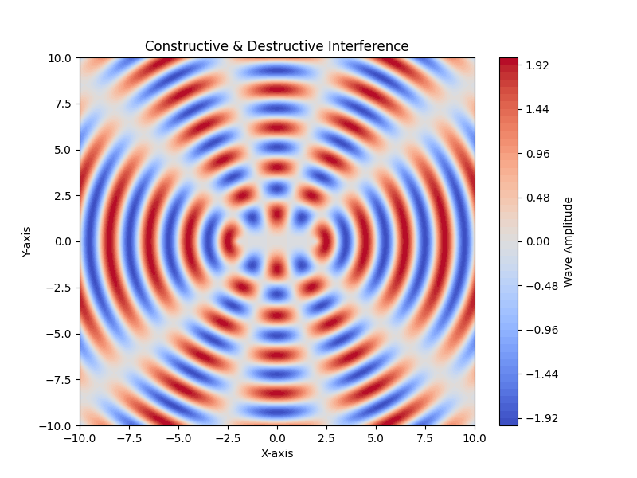

# Problem 1

#  # TASK1 

### Task Recap:
We need to analyze the interference patterns on a water surface due to waves emitted from point sources placed at the vertices of a regular polygon. The wave from each source is described by the Single Disturbance equation:

\[
\eta(x, y, t) = \frac{A}{\sqrt{r}} \cdot \cos(kr - \omega t + \phi)
\]

Where:
- \(\eta(x, y, t)\): Displacement of the water surface at point \((x, y)\) at time \(t\),
- \(A\): Amplitude of the wave,
- \(k = \frac{2\pi}{\lambda}\): Wave number (related to wavelength \(\lambda\)),
- \(\omega = 2\pi f\): Angular frequency (related to frequency \(f\)),
- \(r = \sqrt{(x - x_0)^2 + (y - y_0)^2}\): Distance from the source at \((x_0, y_0)\) to the point \((x, y)\),
- \(\phi\): Initial phase.

### Step 1: Select a Regular Polygon
Let’s choose a simple regular polygon to keep things manageable: an **equilateral triangle**. It has 3 vertices, which means we’ll have 3 point sources. This is a good starting point to observe interference patterns without overcomplicating the math.

---

### Step 2: Position the Sources
Place the equilateral triangle in the \(xy\)-plane, centered at the origin for simplicity. Let the side length of the triangle be \(d\). The vertices of an equilateral triangle can be positioned as follows (using basic geometry):

- Vertex 1: \((x_1, y_1) = (0, \frac{d}{\sqrt{3}})\) (top vertex),
- Vertex 2: \((x_2, y_2) = \left(-\frac{d}{2}, -\frac{d}{2\sqrt{3}}\right)\) (bottom-left vertex),
- Vertex 3: \((x_3, y_3) = \left(\frac{d}{2}, -\frac{d}{2\sqrt{3}}\right)\) (bottom-right vertex).

These coordinates ensure the triangle is equilateral and centered at the origin (the centroid of the triangle is at \((0, 0)\)).

---

### Step 3: Wave Equations
Each source emits a circular wave described by the given equation. Let’s assume the waves have the same amplitude \(A\), wave number \(k\), angular frequency \(\omega\), and initial phase \(\phi = 0\) (for simplicity, unless specified otherwise). The wave from each source at a point \((x, y)\) on the water surface is:

- **Source 1 at \((x_1, y_1)\):**
  \[
  r_1 = \sqrt{(x - x_1)^2 + (y - y_1)^2} = \sqrt{\left(x - 0\right)^2 + \left(y - \frac{d}{\sqrt{3}}\right)^2}
  \]
  \[
  \eta_1(x, y, t) = \frac{A}{\sqrt{r_1}} \cos(kr_1 - \omega t)
  \]

- **Source 2 at \((x_2, y_2)\):**
  \[
  r_2 = \sqrt{(x - x_2)^2 + (y - y_2)^2} = \sqrt{\left(x - \left(-\frac{d}{2}\right)\right)^2 + \left(y - \left(-\frac{d}{2\sqrt{3}}\right)\right)^2}
  \]
  \[
  \eta_2(x, y, t) = \frac{A}{\sqrt{r_2}} \cos(kr_2 - \omega t)
  \]

- **Source 3 at \((x_3, y_3)\):**
  \[
  r_3 = \sqrt{(x - x_3)^2 + (y - y_3)^2} = \sqrt{\left(x - \frac{d}{2}\right)^2 + \left(y - \left(-\frac{d}{2\sqrt{3}}\right)\right)^2}
  \]
  \[
  \eta_3(x, y, t) = \frac{A}{\sqrt{r_3}} \cos(kr_3 - \omega t)
  \]

---

### Step 4: Superposition of Waves
The principle of superposition states that the total displacement at a point \((x, y)\) is the sum of the displacements from each wave:

\[
\eta_{\text{total}}(x, y, t) = \eta_1(x, y, t) + \eta_2(x, y, t) + \eta_3(x, y, t)
\]

Substitute the wave equations:

\[
\eta_{\text{total}}(x, y, t) = \frac{A}{\sqrt{r_1}} \cos(kr_1 - \omega t) + \frac{A}{\sqrt{r_2}} \cos(kr_2 - \omega t) + \frac{A}{\sqrt{r_3}} \cos(kr_3 - \omega t)
\]

Factor out common terms:

\[
\eta_{\text{total}}(x, y, t) = A \left( \frac{\cos(kr_1 - \omega t)}{\sqrt{r_1}} + \frac{\cos(kr_2 - \omega t)}{\sqrt{r_2}} + \frac{\cos(kr_3 - \omega t)}{\sqrt{r_3}} \right)
\]

---

### Step 5: Analyze the Interference Pattern (Simplified)
To analyze the interference pattern, we need to look for points where the waves interfere constructively (amplitudes add up) or destructively (amplitudes cancel out). This equation is complex to solve analytically for all points \((x, y)\), but we can make some observations:

- **Constructive Interference:** Occurs when the phase difference between waves is a multiple of \(2\pi\), i.e., \(k(r_i - r_j) = 2\pi m\) (where \(m\) is an integer). This happens when the path difference \(|r_i - r_j|\) is a multiple of the wavelength \(\lambda\):

\[
|r_i - r_j| = m\lambda \quad \text{(since \(k = \frac{2\pi}{\lambda}\), so \(k|r_i - r_j| = \frac{2\pi}{\lambda} |r_i - r_j| = 2\pi m\))}.
\]

- **Destructive Interference:** Occurs when the phase difference is an odd multiple of \(\pi\), i.e., \(k(r_i - r_j) = (2m+1)\pi\), or:

\[
|r_i - r_j| = (m + \frac{1}{2})\lambda.
\]

- **Pattern Description:** For three sources in an equilateral triangle, the interference pattern will be symmetric around the center. You’ll see regions of high amplitude (constructive interference) where the waves from all three sources are in phase, and regions of low amplitude (destructive interference) where they cancel out. The \(\frac{A}{\sqrt{r}}\) term means the amplitude decreases with distance, so the pattern will be more pronounced closer to the sources.

---

### Simple Solution Summary:
- **Polygon Chosen:** Equilateral triangle with side length \(d\).
- **Source Positions:** Vertices at \((0, \frac{d}{\sqrt{3}})\), \(\left(-\frac{d}{2}, -\frac{d}{2\sqrt{3}}\right)\), and \(\left(\frac{d}{2}, -\frac{d}{2\sqrt{3}}\right)\).
- **Total Displacement:**
  \[
  \eta_{\text{total}}(x, y, t) = A \left( \frac{\cos(kr_1 - \omega t)}{\sqrt{r_1}} + \frac{\cos(kr_2 - \omega t)}{\sqrt{r_2}} + \frac{\cos(kr_3 - \omega t)}{\sqrt{r_3}} \right)
  \]
- **Interference Pattern:** Expect a symmetric pattern with regions of constructive interference (where path differences are multiples of \(\lambda\)) and destructive interference (where path differences are odd multiples of \(\lambda/2\)).

https://files.oaiusercontent.com/file-A3iHhg47PPzAeTTbQ7HT3P?se=2025-03-27T14%3A14%3A03Z&sp=r&sv=2024-08-04&sr=b&rscc=max-age%3D604800%2C%20immutable%2C%20private&rscd=attachment%3B%20filename%3D98822e26-209c-4d88-8076-5bbc667cbf73.webp&sig=A2cAyB2PWKIZBJowMxXg2Lbu7731BiARgUUqP/n6m2U%3D

# DELIVERABLES

# 2.

A detailed explanation of the interference patterns observed for the chosen regular polygon with the goal of understanding wave superposition.

 ### **Interference Patterns in a Regular Polygonal Wave Source Arrangement**  

Interference patterns arise from the superposition of waves originating from multiple sources. When waves meet, their amplitudes combine according to the principle of superposition, creating regions of **constructive interference** (where waves reinforce each other) and **destructive interference** (where waves cancel each other out). The specific arrangement of sources influences the resulting pattern significantly.  

#### **1. Wave Sources Arranged in a Regular Polygon**  
Consider a set of wave sources positioned at the vertices of a regular \( n \)-sided polygon, such as a triangle, square, pentagon, or hexagon. Each vertex acts as a point source emitting circular wavefronts that propagate outward. The interference pattern observed depends on the symmetry and spacing of these sources.  

#### **2. Constructive and Destructive Interference**  
- **Constructive Interference:** This occurs at points where the path difference between waves from different sources is an integer multiple of the wavelength (\( m\lambda \), where \( m \) is an integer). Such points appear as bright or high-intensity regions.  
- **Destructive Interference:** This happens where the path difference is a half-integer multiple of the wavelength (\( (m + 0.5)\lambda \)), leading to cancellation of wave amplitudes. These regions appear as dark or low-intensity zones.  

#### **3. Symmetric Interference Patterns**  
- **Triangle (Equilateral):** Produces a threefold rotational symmetry in the interference pattern, forming a repeating set of high-intensity nodes at specific radial distances.  
- **Square:** Interference fringes align along the symmetry axes, creating a checkerboard-like arrangement of constructive and destructive interference regions.  
- **Pentagon and Higher Polygons:** As the number of sources increases, the pattern becomes increasingly intricate, with radial symmetry intensifying at the center and forming concentric nodal structures.  

#### **4. Wavelength and Source Spacing Effects**  
- If the wavelength is large relative to the polygon size, only a few interference fringes form, appearing as broad intensity variations.  
- If the wavelength is small, intricate interference patterns emerge with fine spacing between constructive and destructive zones.  

#### **5. Application in Wave Physics**  
Understanding such interference patterns is fundamental in wave optics, acoustics, and quantum mechanics. These principles are used in diffraction gratings, antenna arrays, and even quantum wavefunctions.  

3. 
Graphical representations of the water surface showing constructive and destructive interference regions.

