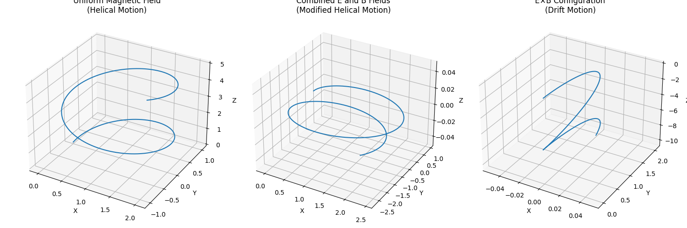
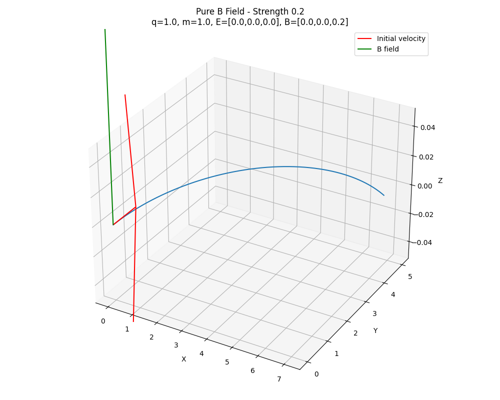
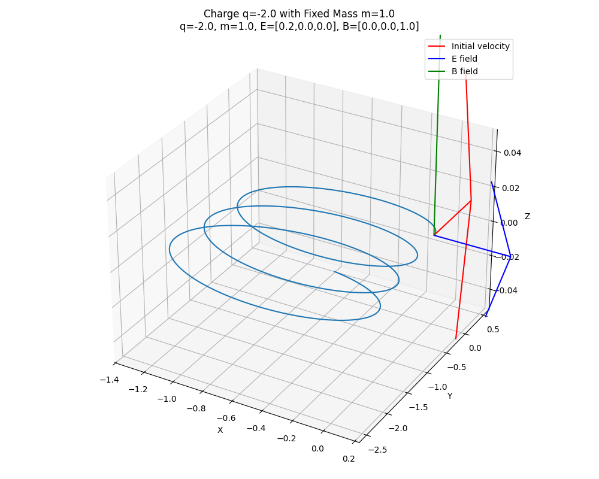
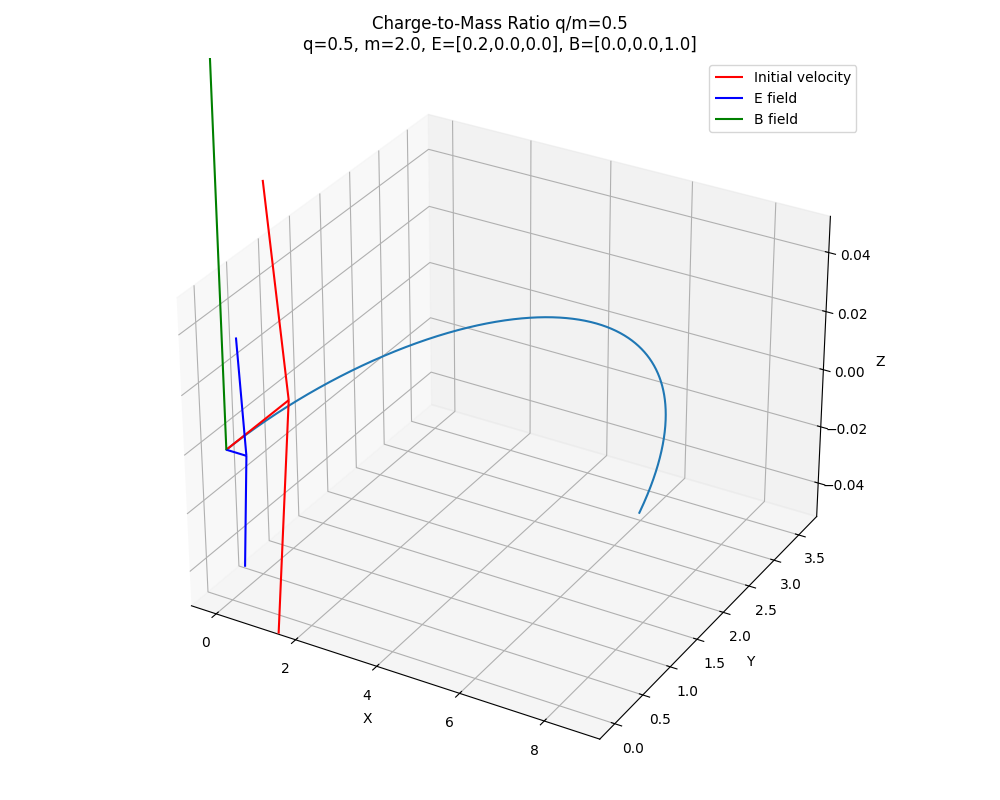
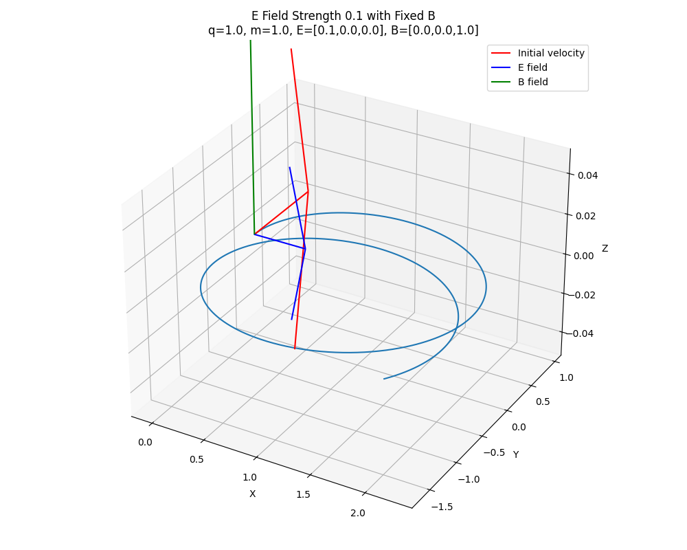

# Problem 1

# 1 Exploration of Applications:**

**# Particle Accelerators:**

 Use magnetic fields to bend charged particles into circular paths and electric fields to accelerate them, enabling high-energy particle physics research.

**# Mass Spectrometers:**

Separate ions by mass-to-charge ratio using magnetic fields that create different curved trajectories.

**# Plasma Confinement:**

Contain hot plasma in fusion reactors using magnetic fields that keep charged particles away from reactor walls.

**# Hall Effect Thrusters:**

 Spacecraft propulsion systems using crossed electric and magnetic fields to accelerate ions.

**# Cyclotrons and Synchrotrons:**

 Medical and research devices that accelerate particles in spiral or circular paths.

**# MRI Machines:**

 Use strong magnetic fields to align protons in the body and radio frequency pulses to create diagnostic images.

**# Relevance of electric (E) and magnetic (B) fields:**

Electric fields provide direct acceleration of charged particles along field lines, controlling their energy.

Magnetic fields create perpendicular forces to particle velocity, controlling particle direction without changing energy directly.
Together, they enable precise control of:

Particle trajectories
Confinement boundaries
Energy levels
Beam focusing
Sorting particles by properties

This control makes possible technologies from cancer treatments to space propulsion systems.

# The simulation of particle motion

# Parameter exploration:

,  ,  , 
