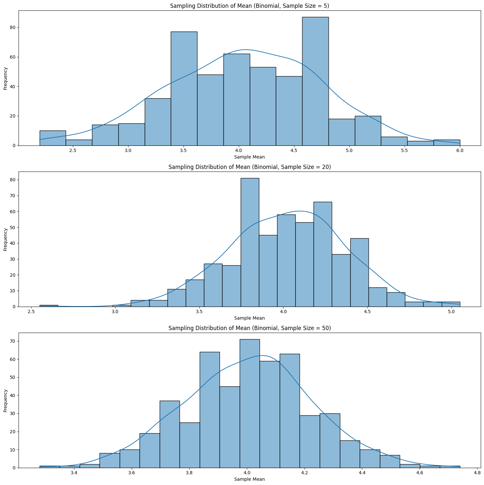

# Problem 1

# Simulating Sampling Distributions:

```python
import numpy as np
import matplotlib.pyplot as plt
import seaborn as sns

population_size = 10000
num_samples = 500
sample_sizes = [5, 20, 50]

uniform_population = np.random.uniform(0, 1, population_size)
lambda_param = 2
exponential_population = np.random.exponential(1/lambda_param, population_size)
n_param = 10
p_param = 0.4
binomial_population = np.random.binomial(n_param, p_param, population_size)

plt.figure(figsize=(15, 5))

plt.subplot(1, 3, 1)
sns.histplot(uniform_population, kde=True)
plt.title('Uniform Distribution Population')

plt.subplot(1, 3, 2)
sns.histplot(exponential_population, kde=True)
plt.title('Exponential Distribution Population')

plt.subplot(1, 3, 3)
sns.histplot(binomial_population, kde=True, discrete=True)
plt.title('Binomial Distribution Population')

plt.tight_layout()
plt.show()
```


# Sampling and Visualization:

```python
import numpy as np
import matplotlib.pyplot as plt
import seaborn as sns

population_size = 10000
num_samples = 500
sample_sizes = [5, 20, 50]

def plot_sampling_distribution(population, population_name, sample_sizes, num_samples):
    """
    Generates and plots the sampling distribution of the mean for a given population
    and different sample sizes.
    """
    plt.figure(figsize=(15, 5 * len(sample_sizes)))
    for i, sample_size in enumerate(sample_sizes):
        sample_means = []
        for _ in range(num_samples):
            sample = np.random.choice(population, size=sample_size, replace=False)
            sample_means.append(np.mean(sample))

        plt.subplot(len(sample_sizes), 1, i + 1)
        sns.histplot(sample_means, kde=True)
        plt.title(f'Sampling Distribution of Mean ({population_name}, Sample Size = {sample_size})')
        plt.xlabel('Sample Mean')
        plt.ylabel('Frequency')
    plt.tight_layout()
    plt.show()
plot_sampling_distribution(uniform_population, 'Uniform', sample_sizes, num_samples)
plot_sampling_distribution(exponential_population, 'Exponential', sample_sizes, num_samples)
plot_sampling_distribution(binomial_population, 'Binomial', sample_sizes, num_samples)
```


