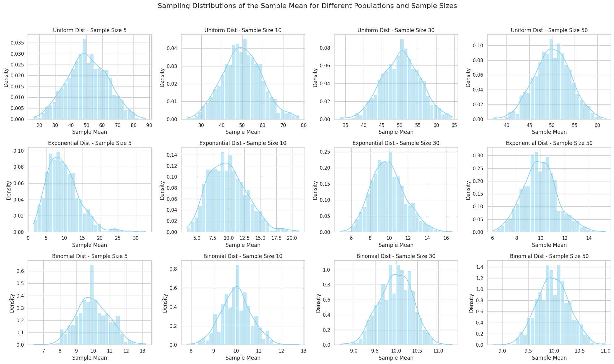

# Problem 1

# Simulating Sampling Distributions:

```python
import numpy as np
import matplotlib.pyplot as plt
import seaborn as sns

population_size = 10000
num_samples = 500
sample_sizes = [5, 20, 50]

uniform_population = np.random.uniform(0, 1, population_size)
lambda_param = 2
exponential_population = np.random.exponential(1/lambda_param, population_size)
n_param = 10
p_param = 0.4
binomial_population = np.random.binomial(n_param, p_param, population_size)

plt.figure(figsize=(15, 5))

plt.subplot(1, 3, 1)
sns.histplot(uniform_population, kde=True)
plt.title('Uniform Distribution Population')

plt.subplot(1, 3, 2)
sns.histplot(exponential_population, kde=True)
plt.title('Exponential Distribution Population')

plt.subplot(1, 3, 3)
sns.histplot(binomial_population, kde=True, discrete=True)
plt.title('Binomial Distribution Population')

plt.tight_layout()
plt.show()
```


# Sampling and Visualization:

```python
import numpy as np
import matplotlib.pyplot as plt
import seaborn as sns

# Set style for seaborn
sns.set(style="whitegrid")

# Parameters
sample_sizes = [5, 10, 30, 50]
n_repeats = 1000
population_size = 100000

# Distributions to simulate
distributions = {
    "Uniform": np.random.uniform(0, 100, population_size),
    "Exponential": np.random.exponential(scale=10, size=population_size),
    "Binomial": np.random.binomial(n=20, p=0.5, size=population_size),
}

# Create subplots
fig, axs = plt.subplots(len(distributions), len(sample_sizes), figsize=(20, 12))
fig.suptitle('Sampling Distributions of the Sample Mean for Different Populations and Sample Sizes', fontsize=16)

# Loop over each distribution
for i, (dist_name, population) in enumerate(distributions.items()):
    # Loop over each sample size
    for j, sample_size in enumerate(sample_sizes):
        sample_means = []
        for _ in range(n_repeats):
            sample = np.random.choice(population, size=sample_size, replace=False)
            sample_means.append(np.mean(sample))
        # Plot histogram of sample means
        ax = axs[i, j]
        sns.histplot(sample_means, kde=True, ax=ax, stat="density", color="skyblue", bins=30)
        ax.set_title(f'{dist_name} Dist - Sample Size {sample_size}')
        ax.set_xlabel('Sample Mean')
        ax.set_ylabel('Density')

plt.tight_layout(rect=[0, 0, 1, 0.96])
plt.show()

```

 


# Parameter Exploration:

***Investigating the effects of the original distribution and sample size.***

We’ll explore how:

The shape of the original distribution (uniform, exponential, binomial) affects the rate of convergence to a normal distribution as the sample size increases.

The population variance influences the spread of the sample mean distribution.

***Key Insights to Explore:***

## Shape of the original distribution:

### For uniform:

The distribution is already flat, so it might converge to normality fairly quickly.

### For exponential:

This is right-skewed, and convergence to normal might take a bit longer.

### For binomial:

Symmetry can form quickly, depending on the number of trials (n) and the probability (p).

### Effect of population variance:

Larger variances in the population will lead to wider spread (more variability) in the sample mean distribution, even as the sample size increases.

```python
def calculate_variance(sample_means):
    return np.var(sample_means)
uniform_variances = {}
exponential_variances = {}
binomial_variances = {}
for size in sample_sizes:
    uniform_variances[size] = calculate_variance(uniform_sample_means[size])
    exponential_variances[size] = calculate_variance(exponential_sample_means[size])
    binomial_variances[size] = calculate_variance(binomial_sample_means[size])

plt.figure(figsize=(10, 6))
plt.plot(sample_sizes, list(uniform_variances.values()), label='Uniform', marker='o', color='green')
plt.plot(sample_sizes, list(exponential_variances.values()), label='Exponential', marker='o', color='red')
plt.plot(sample_sizes, list(binomial_variances.values()), label='Binomial', marker='o', color='blue')
plt.title('Variance of Sample Means vs. Sample Size')
plt.xlabel('Sample Size')
plt.ylabel('Variance of Sample Means')
plt.legend()
plt.grid(True)
plt.show()
```

 


